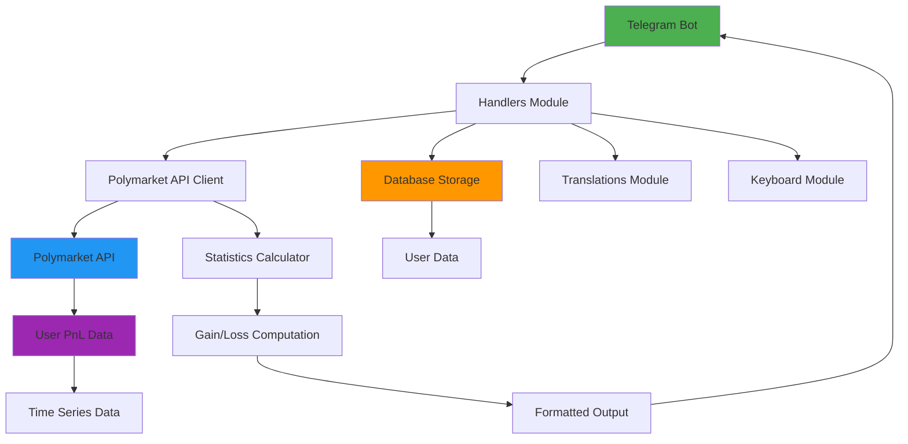

# BetSpy Polymarket Bot

A sophisticated Telegram bot that tracks and analyzes Polymarket trading performance with detailed statistics and PnL reporting.

## Features

- **Detailed Trading Statistics**: View comprehensive statistics for 1D, 1W, 1M, and ALL time periods
- **Portfolio Value Tracking**: Monitor positions value and portfolio growth over time
- **Accurate PnL Calculation**: Real-time profit and loss calculation using Polymarket's official API
- **Win/Loss Analysis**: Detailed breakdown of gains, losses, and net totals for each period
- **Multi-language Support**: Available in English, Ukrainian, and Russian
- **User Profile Monitoring**: Track specific user profiles and their trading activity
- **API Integration**: Direct integration with Polymarket's user PnL API

## Architecture



## Quick Start

### Prerequisites

- Python 3.8+
- pip package manager
- Telegram Bot Token (from [@BotFather](https://t.me/BotFather))
- Polymarket API access

### Installation

1. Clone the repository:
```bash
git clone <repository-url>
cd polymarket-whale-bot
```

2. Install dependencies:
```bash
pip install -r requirements.txt
```

3. Set up environment variables:
```bash
cp env.example .env
```

4. Edit `.env` file with your configuration:
```
TELEGRAM_BOT_TOKEN=your_telegram_bot_token
DATABASE_URL=sqlite:///bot_database.db
POLYMARKET_API_URL=https://user-pnl-api.polymarket.com
```

### Running the Bot

#### Direct execution:
```bash
python main.py
```

#### Using Docker:
```bash
docker build -t polymarket-whale-bot .
docker run -d --env-file .env polymarket-whale-bot
```

### Commands

- `/start` - Initialize the bot and show welcome message
- `/profile` - View your Polymarket profile statistics
- `/statistics` - Access detailed trading statistics
- `/help` - Show help information

## Bot Functions

### Statistics Overview

The bot provides comprehensive trading statistics with the following metrics:

- **Positions Value**: Current portfolio value
- **Biggest Win**: Largest single winning trade
- **Predictions Count**: Total number of trades made
- **Gain/Loss/Net Total**: Profitability breakdown for selected time period

### Supported Time Periods

- **1D**: Last 24 hours
- **1W**: Last 7 days  
- **1M**: Last 30 days
- **ALL**: All-time statistics

### Data Accuracy

The bot uses Polymarket's official API endpoints to ensure data accuracy:

- Direct integration with `/user-pnl` endpoint
- Proper fidelity mapping for different time intervals
- Accurate PnL calculation matching Polymarket's frontend algorithm
- FIFO accounting for win/loss statistics

## Technical Details

### API Integration

The bot connects to Polymarket's user PnL API with the following fidelity mappings:
- 1D → 1h intervals
- 1W → 3h intervals  
- 1M → 18h intervals
- ALL → 12h intervals

### Data Processing

- Time-series data processing for accurate PnL calculation
- Proper handling of (t,p) points from API responses
- FIFO accounting method for win/loss tracking
- Proxy wallet address usage for API calls

### Database Schema

The bot uses SQLite to store:
- User profiles and settings
- Trading history
- Statistics cache
- Session data

## Configuration

### Environment Variables

| Variable | Description | Default |
|----------|-------------|---------|
| `TELEGRAM_BOT_TOKEN` | Telegram bot token from BotFather | - |
| `DATABASE_URL` | Database connection string | sqlite:///bot_database.db |
| `POLYMARKET_API_URL` | Polymarket API base URL | https://user-pnl-api.polymarket.com |

### Customization

You can customize the bot behavior by modifying:

- `config.py` - Main configuration settings
- `translations.py` - Multi-language support
- `handlers.py` - Message and callback handlers
- `keyboards.py` - Interactive keyboard layouts

## Development

### Adding New Features

1. Extend the handler functions in `handlers.py`
2. Add new keyboard layouts in `keyboards.py`
3. Update translations in `translations.py`
4. Modify database models in `models.py` if needed

### Testing

Run the bot locally to test new features:
```bash
python main.py
```

Monitor logs for any errors or unexpected behavior.

## Troubleshooting

### Common Issues

1. **API Connection Errors**: Verify your Polymarket API URL and connectivity
2. **Database Errors**: Check your database connection string and permissions
3. **Telegram Bot Issues**: Confirm your bot token is valid and bot is properly configured

### Support

For support, check the logs and verify:
- All environment variables are properly set
- Internet connectivity is stable
- Polymarket API is accessible
- Database connection is established

## Contributing

1. Fork the repository
2. Create a feature branch
3. Make your changes
4. Submit a pull request

Please ensure your code follows the existing style and includes appropriate tests.

License - MIT
